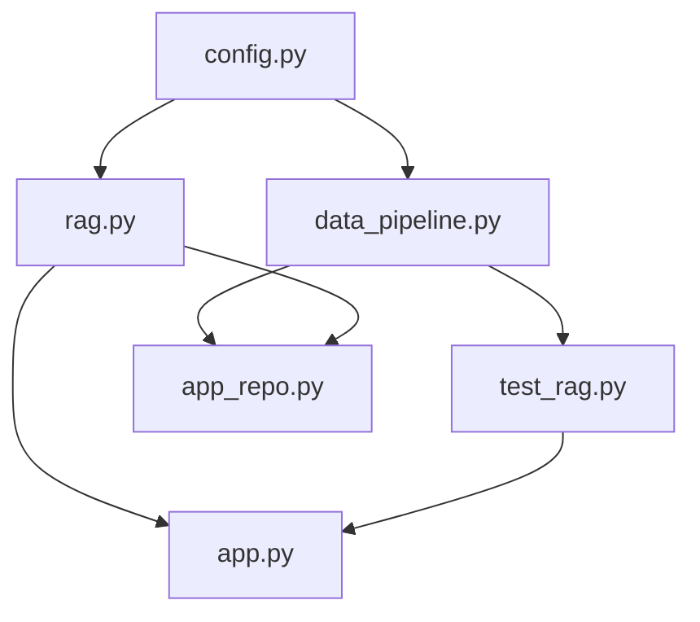
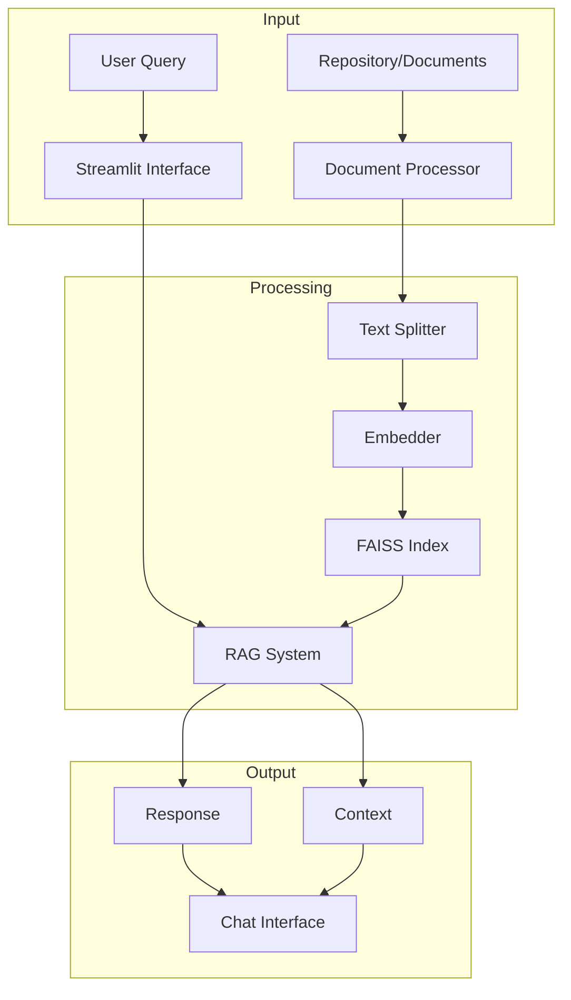
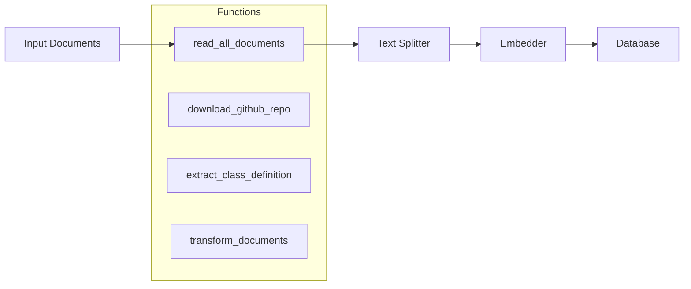
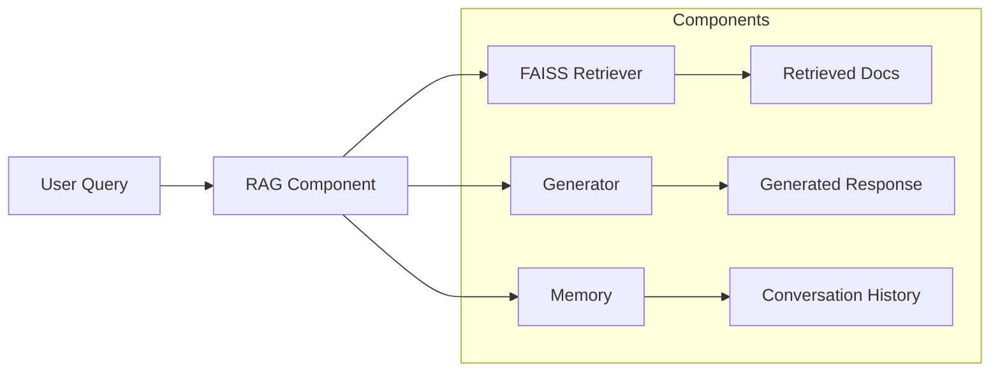
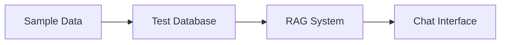
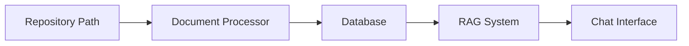
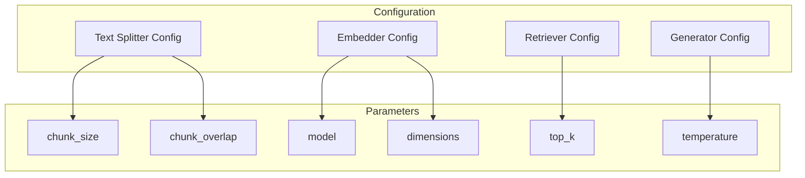
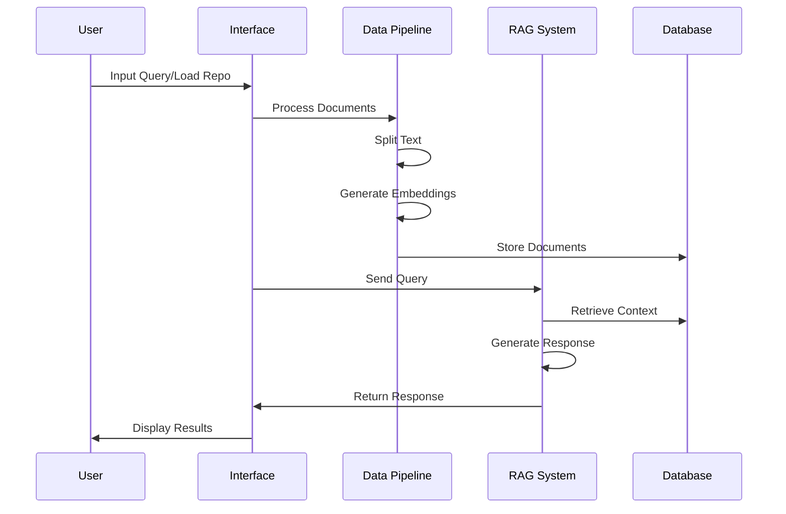
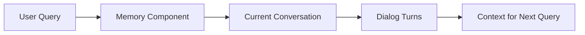

# Repository Architecture

This document explains how the different components of the RAG (Retrieval-Augmented Generation) system work together.

## File Structure and Dependencies

## Data Flow

## Component Responsibilities

### Core Components

1. `data_pipeline.py`

2. `rag.py`

### Interface Components

1. `app.py` (Demo Interface)

2. `app_repo.py` (Repository Analysis Interface)

## Configuration (`config.py`)

## Data Processing Pipeline

## Memory Management

This architecture provides:
- Modular components that can be easily modified
- Clear separation of concerns
- Two interfaces (demo and repository analysis)
- Configurable parameters for text processing
- Conversation memory management